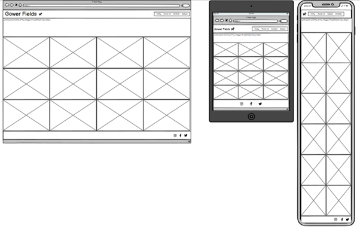

<h1 align="center"> Gower Fields </h1>

# Table of Contents

- [Introduction](#introduction)
- [User Goals and Stories](#user-goals-and-stories)
  * [Website Owner Business Goals](#website-owner-business-goals)
  * [User Goals](#user-goals)
  * [User Stories](#user-stories)
- [Design](#design)
  * [Font & Colours](#fonts--colours)
  * [Images](#images)
  * [Wireframes](#wireframes)
- [Features](#features)
- [Languages](#languages)
  * [Technologies used](#technologies-used)
- [Testing](#testing)
- [Deployment](#deployment)
- [Bugs](#bugs)
- [Credits](#credits)

# Introduction

This is a fictional website to give potential customers an idea of what Gower Fields provides. Gower Fields provides the users somewhere where they can let their dogs off the lead in a safe environment. Owners are able to relax while their pets run or walk in the secure fields provided. Gower Fields allows owners a chance to interact with other dog owners and they can socialise their pets if so desired. The site will allow the user to contact the business to ask questions as well as informing the user about services, location and a gallery area to check out other customers' photos.  

# User Goals and Stories

## Website Owner Business Goals

As the owner of the business, I would like to

- Share services with customers.
- Give clear, specific and up-to date information in order to attract customers.
- Link with social media accounts to add authenticity to the business.
- Allow the user to contact the business via a form.

## User Goals

As a user, I would like to

- Locate information in a simple and timely manner.
- Find the location of the business.
- Find the opening times of the business.
- Easily navigate the site using a recognisable layout.
- Look at the experience other customers have.

## User Stories

### First Time User

1. As a first-time user, I want to be able to navigate the website to find content easily.
2. As a first-time user, I want to understand what the website offers so I can make an informed decision. 
3. As a first-time user, I want to find where this location is and when it is open so I can make an informed decision. 
4. As a first-time user, I want to access the website on a variety of screen sizes.

### Returning User

1. As a returning user, I want to submit a contact form to ask questions and clarify information.
2. As a returning user, I want to access social media links to see other users’ experiences.
3. As a returning user, I want to access specific information and choose a field which is most suitable.

### Business Owner

1. As a business owner, I want to provide users with clear information, so they know what we offer.
2. As a business owner, I want to provide an easy-to-use contact form so they can get in touch with a response page so they feel valued.
3. As a business owner, I want to show users the grounds and images from other customers so they can know what other people experience.
4. As a business owner, I want to promote the business by linking with social media to make the business more accessible.

## Design

### Fonts & Colours

Google fonts was used in order to import Poppins and as a back-up font Sans Serif. Poppins was chosen to convey a modern and simple style while being easy to read. A colour scheme was chosen from [Coolors](https://coolors.co/). This colour scheme was chosen to convey the mood of the website. The earth coloured tones set the atmosphere of the site as it evokes feelings of being outside in nature. The colours were slightly altered from the original palette due to contrast issues.

### Images 

All images have been taken from websites that will be attributed in the credits section. These images have been re-sized to make them more appealing and consistent using a re-sizing tool. The images used are included to add to the visual appeal of the site. The colours in the images are ones with neutral and natural tones to keep inline with the colour scheme that was chosen.

### Wireframes

#### Home Page Wirferames

#### About Page Wireframes

#### Gallery Page Wireframes

#### Contact Page Wireframes

## Features

### Navigation Bar

- The navigation bar is located at the top of each page on the site.
- The bar links well with the colour scheme of the main content and does not distract.
- On the left hand side of the navigation bar, there is the name of the business and its logo.
- Clicking on the logo on the left-hand side will take you back to the home page.
- On the right-hand side of the navigation bar, there are links to the other pages (Home, About, Gallery and Contact).
- When hovering over a link, the word changes colour, keeping with the color scheme.
- Also, the page link will be underlined when it is active.
- The bar is responsive and on smaller screen sizes the links for the other pages push into the middle.

### Footer

- The footer uses the same colour scheme as the navigation bar to make the site more visually appealing.
- The footer is located at the bottom of all pages as the user would expect.
- The footer consists of three links to the social media accounts of the business.
- Hovering over the icons the colour switches in a pleasing effect.
- All links have been tested and work.

### Hero Images

- Many pages within the site contain large, high quality images that act to entice the customer. 
- The hero image on the first page contains a small message that gives an indication of what the business is about.

### Home Page

- This page acts as the landing page. It has a enticing and visually pleasing hero image and gives a clear indication of what the business is.
- Towards the bottom of the home page are more visually appealing images that align with the sites color palette.
- The information on the home page is minimal, designed not to overwhelm any potential users.
- The text is desinged to give a brief intorduction to the business and what users can expect.
- There is a call to action button, which will take the user directly to the contact page where they can fill out a form to ask any queires or questions.

### About

- The page is where users find out more information about the services offered.
- It is split into three columns in order to make it more readable.
- Images are inline with the style of the site and have been put in to make the page more attractive.
- Two of the three columns describe the types of services offered.
- The middle column gives information about the address and includes a google maps iframe so customers can easily locate the business.

### Gallery

- This page includes images from other users.
- This is designed to allow customers see what types of experiences their pets could have if they choose Gower Fields.
- The photos used have been chosen as they fit in with the style of the page.

### Contact 

- On this page, the user is encouraged to ask about any questions that they may have.
- This page contains a form that the user will be required to fill out if they wish to pose a question.
- All fields must be filled out correctly and the email address must be a legitimate email address with an @ sign.
- There is a response page that the user a directed to, upon completion of the contact form.
- This response page contains a short friendly message thanking the user for their question. It also includes the icon used in the navigation bar to take them back to the home page.

## Languages

- [HTML](https://en.wikipedia.org/wiki/HTML) was used to create the layout of the site.
- [CSS](https://en.wikipedia.org/wiki/CSS) was used to style the site.

### Technologies used 

- [Google Fonts](https://fonts.google.com/) - this was used to import the fonts Poppins and Sans-serif, which is used throughout the site.
- [Font Awesome](https://fontawesome.com/) - this was used in order to have icons load onto certain pages.
- [BIRME](https://www.birme.net/) - this was used to re-size the images throughout the site.
- [Balsamiq](https://balsamiq.com/) - this was utilised to create my wireframes.
- [Git](https://git-scm.com/) - this was used for version control, using the terminal to add, commit and push to GitHub.
- [Gitpod](https://www.gitpod.io/) - this was the IDE used to code.
- [GitHub](https://github.com/) - this is used to store the project in a repository.
- [Google maps](https://www.google.co.uk/maps/@51.6114098,-4.2372575,10.42z?entry=ttu) - this was used to provide the map on the about page.

## Testing 

Please see the [TESTING.md](TESTING.md) file for all testing

## Deployment

## Bugs 

This list compromises of the bugs that I had significant struggles with;

- The images did not load upon first deploying via GitHub - fixed by using the correct path to my assets folder.

- The width of the background was shorter than the footer - fixed by hiding the overflow of the footer.

- Error code 404 shown when previewing site. Favicon on tab was not loading correctly - fixed by adding in code for favicon to load.

- Gallery images were not the same size as each other and it looked jarring - fixed by re-sizing all images to same size.

- A white space appeared on all pages underneath my content but above my footer - fixed by applying style 'min-height' to the body.

- The columns on the about page were in the correct order on the desktop view, however I wanted them in a different order on mobile and tablet - fixed by using the order class.

## Credits

The following list is to attribute my photos and any code that I used from external sources.

### Photos

The following websites were used:

[Pexels.com](https://www.pexels.com/)
[Unsplash.com](https://unsplash.com/)
[Freepik.com](https://www.freepik.com/)

And credit goes to the individual photographers for these stunning images.

