# Gower Fields

## Testing

In this section, I will demonstrate a variety of tests that my site went through to ensure that it hit the criteria of the assessment.

### Code Validation

##### HTML validation

I have put all html pages through the [HTML W3C Validator](https://validator.w3.org) in order to validate my site.

Home page - passed with no errors

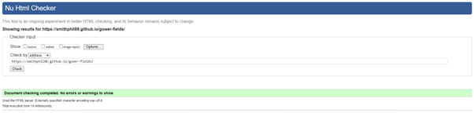

About page - passed with no errors

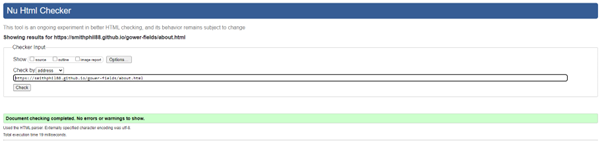

Gallery page - passed with no errors but with warnings.

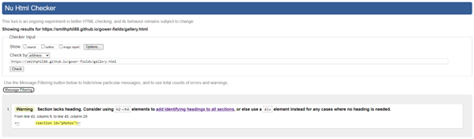

Contact page - passed with no errors but with warnings.

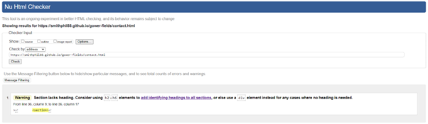

Response page - passed with no errors but with warnings.

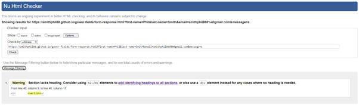

All warnings suggested that I use h2-h6 values to organise the page. Or to use a div to organise them. I have used a div but the warnings still appeared.

##### CSS validation

I used the suggested [CSS Jigsaw Validator](https://jigsaw.w3.org/css-validator) to validate my CSS.

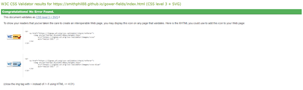

### User Stories

The following screenshots evidence how the site has synced up with the user stories.

#### First Time User

1. As a first-time user, I want to be able to navigate the website to find content easily. ***Pass***

2. As a first-time user, I want to understand what the website offers so I can make an informed decision. ***Pass***

3. As a first-time user, I want to find where this location is and when it is open so I can make an informed decision. ***Pass***

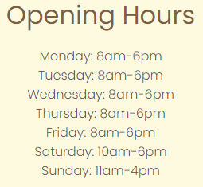

4. As a first-time user, I want to access the website on a variety of screen sizes. ***Pass***

#### Returning User

1. As a returning user, I want to submit a contact form to ask questions and clarify information. ***Pass***

2. As a returning user, I want to access social media links to see other users’ experiences. ***Pass***

3. As a returning user, I want to access specific information and choose a field which is most suitable. ***Pass***

#### Business Owner

1. As a business owner, I want to provide users with clear information, so they know what we offer. ***Pass***

2. As a business owner, I want to provide an easy-to-use contact form so they can get in touch with a response page so they feel valued. ***Pass***

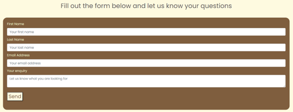
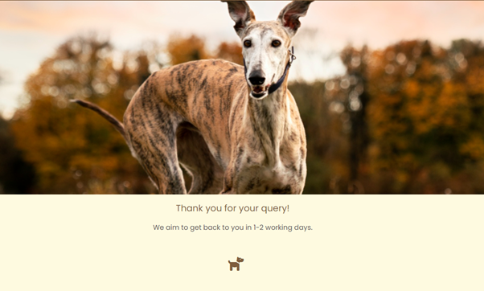

3. As a business owner, I want to show users the grounds and images from other customers so they can know what other people experience. ***Pass***

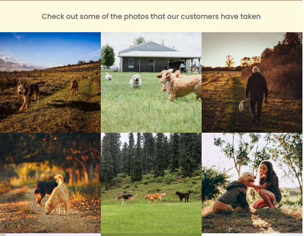

4. As a business owner, I want to promote the business by linking with social media to make the business more accessible. ***Pass***

### Lighthouse

### Manual Testing

All links within the site have been tested to ensure that they work and all have passed.

Including the following:

1. In the navbar, the Home link takes you to the Home page.
2. The About link will take the user to the About page.
3. The Gallery link will take the user to the Gallery page.
4. The Contact link will take the user to the Contact page.
5. On the Home page, there is a button that takes the user to the Contact page.
6. In the footer, all three social media links to Facebook, Instagram and Tik Tok work and open a new tab.
7. The About page contains a map which opens in google maps.
8. On the Contact Page the form requires the user to present information in order to send the form. This includes a valid email address.
9. The send button will take the user to a Response page.
10. On the Response page the user is directed back to the Home page via the same icon that is on the navbar.

### Responsiveness

My site is responsive across devices of different sizes. I have tested on the following using [responsive viewer](https://responsiveviewer.org/)

| Device and size | Screenshot | Comments
| --- | --- | --- |
| Mobile (Chrome DevTools) | 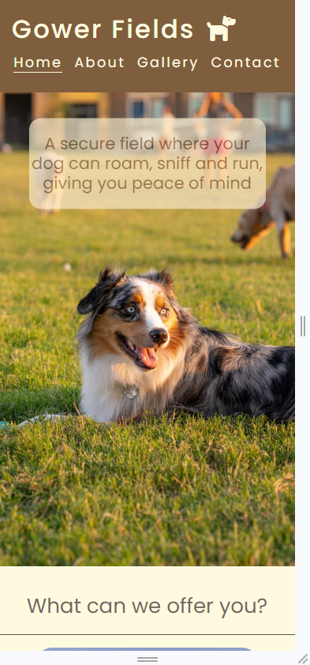 | Pass |
| Mobile (iPhone) | 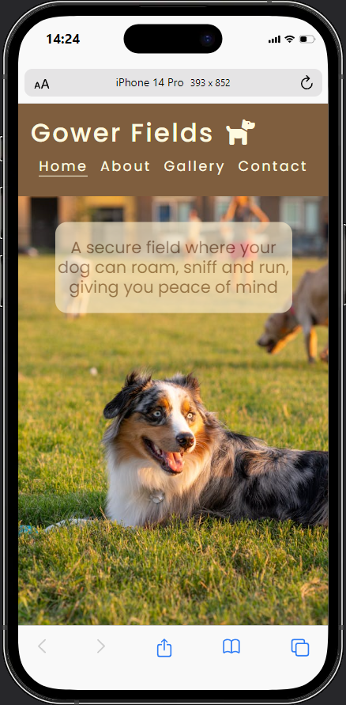 | Pass |
| Mobile (Pixel 7) | 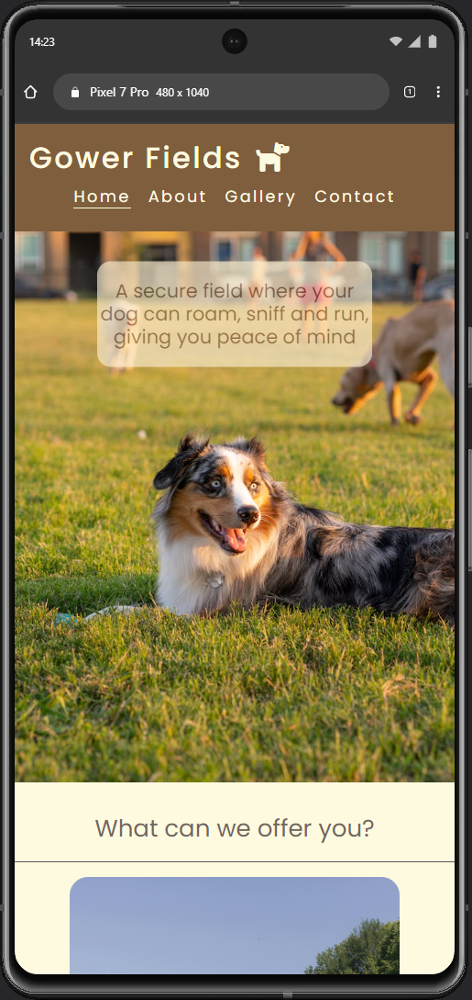 | Pass |
| Tablet (Chrome DevTools) | 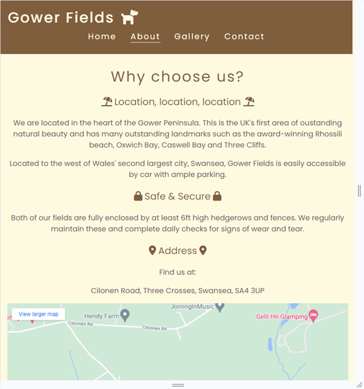 | Pass |
| Tablet (iPad) | 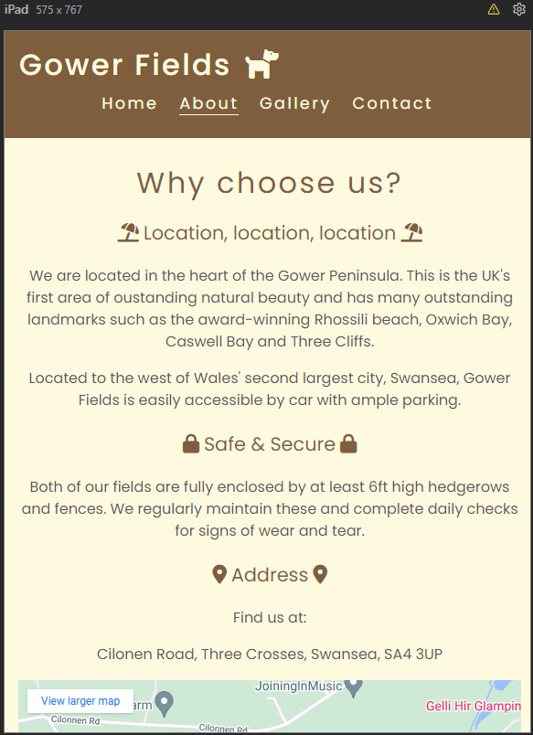 | Pass |
| Tablet (Galaxy Tablet) | 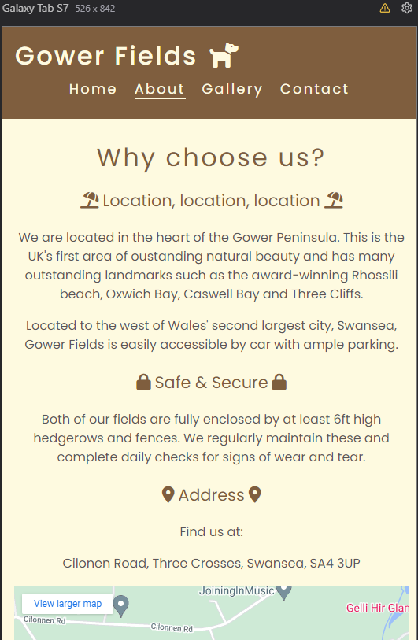 | Pass |
| Large laptop (1440px) | 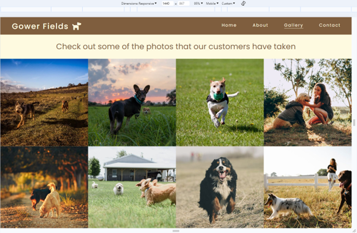 | Pass |
| Desktop (iMac) | 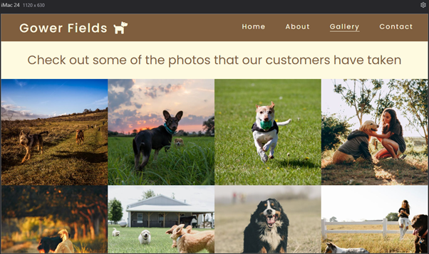 | Pass |
| Desktop (4k DevTools) | 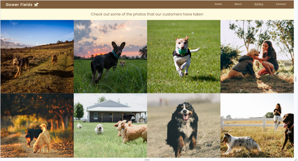 | Pass |

### README

A link back to the [README](README.md) file.