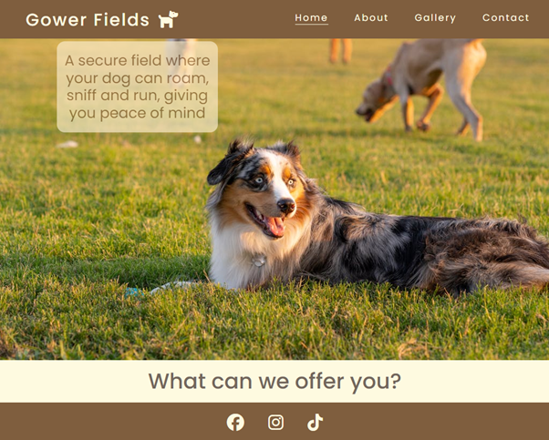

<h1 align="center"> Gower Fields </h1>

# Testing

In this section, I will demonstrate a variety of tests that my site went through to ensure that it hit the criteria of the assessment.

## Code Validation

## User Stories

The following screenshots evidence the how the site has synced up with the user stories.

## First Time User

1. As a first-time user, I want to be able to navigate the website to find content easily.

2. As a first-time user, I want to understand what the website offers so I can make an informed decision.

3. As a first-time user, I want to find where this location is and when it is open so I can make an informed decision.

4. As a first-time user, I want to access the website on a variety of screen sizes.

## Returning User

1. As a returning user, I want to submit a contact form to ask questions and clarify information.

2. As a returning user, I want to access social media links to see other users’ experiences.

3. As a returning user, I want to access specific information and choose a field which is most suitable.

## Business Owner

1. As a business owner, I want to provide users with clear information, so they know what we offer.

2. As a business owner, I want to provide an easy-to-use contact form so they can get in touch.

3. As a business owner, I want to show users the grounds and images from other customers so they can know what other people experience.

4. As a business owner, I want to promote the business by linking with social media to make the business more accessible.

## Lighthouse

## Manual Testing

## Responsiveness

### README

A link back to the [README](README.md) file.