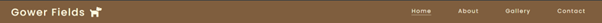

<h1 align="center"> Gower Fields </h1>

# Testing

In this section, I will demonstrate a variety of tests that my site went through to ensure that it hit the criteria of the assessment.

## Code Validation

#### HTML validation

I have put all html pages through the [HTML W3C Validator](https://validator.w3.org) in order to validate my site.

Home page - passed with no errors

About page - passed with no errors

Gallery page - passed with no errors but with warnings.

Contact page - passed with no errors but with warnings.

Response page - passed with no errors but with warnings.

All warnings suggested that I use h2-h6 values to organise the page. Or to use a div to organise them. I have used a div but the warnings still appeared.

#### CSS validation

I used the suggested [CSS Jigsaw Validator](https://jigsaw.w3.org/css-validator) to validate my CSS.

## User Stories

The following screenshots evidence the how the site has synced up with the user stories.

## First Time User

1. As a first-time user, I want to be able to navigate the website to find content easily.

2. As a first-time user, I want to understand what the website offers so I can make an informed decision.

3. As a first-time user, I want to find where this location is and when it is open so I can make an informed decision.

4. As a first-time user, I want to access the website on a variety of screen sizes.

## Returning User

1. As a returning user, I want to submit a contact form to ask questions and clarify information.

2. As a returning user, I want to access social media links to see other users’ experiences.

3. As a returning user, I want to access specific information and choose a field which is most suitable.

## Business Owner

1. As a business owner, I want to provide users with clear information, so they know what we offer.

2. As a business owner, I want to provide an easy-to-use contact form so they can get in touch with a response page so they feel valued.

3. As a business owner, I want to show users the grounds and images from other customers so they can know what other people experience.

4. As a business owner, I want to promote the business by linking with social media to make the business more accessible.

## Lighthouse

## Manual Testing

All links within the site have been tested to ensure that they work and all have passed.

Including the following:

1. All navbar links.
2. All footer links open in a new tab and direct to the relevant social media pages.
3. The map on the about page can be opened in a new tab for a larger map.
4. The button on the home page takes the user to the contact page.
5. The contact form takes the user to a response page with a reply message.
6. The icon on the response page will direct the user back to the home page.

## Responsiveness

My site is responsive across devices of different sizes. I have tested on

## README

A link back to the [README](README.md) file.